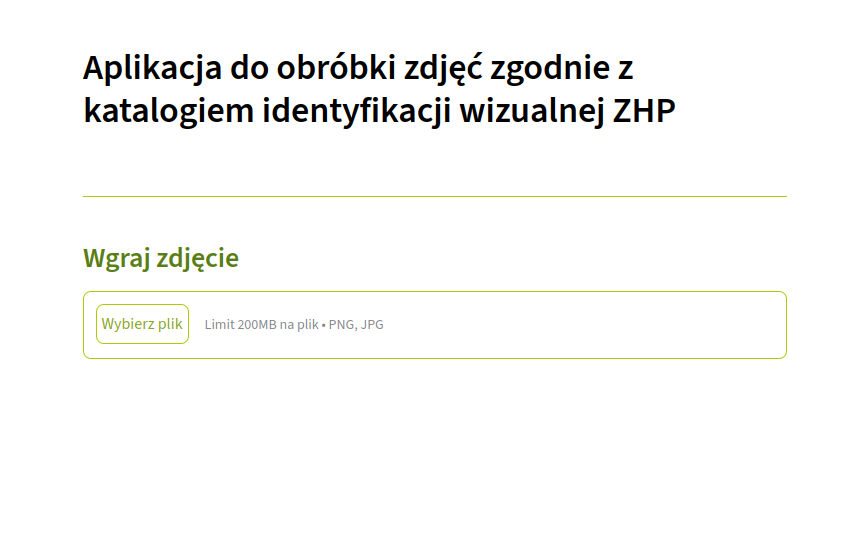
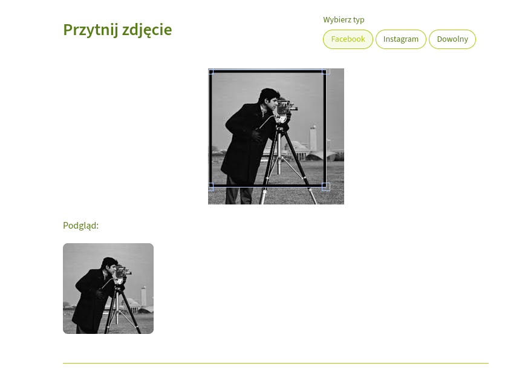
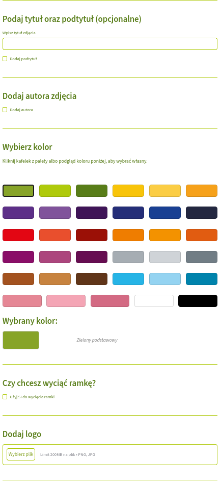

<div align="center">

# ⚜️ ZHP-autokiw

[](https://www.python.org/downloads/)
[](https://github.com/astral-sh/uv)
[](https://streamlit.io/)
[](https://modal.com/)
[](https://developer.mozilla.org/docs/Web/SVG)

*Narzędzie napisane w Pythonie, które automatycznie tworzy grafiki zgodnie z Katalogiem Identyfikacji Wizualnej ZHP.*

</div>

---

## ⚙️ Jak to działa

Aplikacja przyjmuje na wejściu zdjęcie wraz z opcjonalnymi parametrami, którymi są:

- tekst główny,
- tekst dodatkowy,
- autor zdjęcia,
- logo jednostki ZHP,
- kolor (zgodny z KIW).
- format grafiki (1:1 dla Facebooka, 4:5 dla Instagrama oraz dowolny)

Po wprowadzeniu danych skrypt automatycznie generuje ramkę z odpowiednią zawartością i wstawia ją na zdjęcie. Opcjonalnie algorytm wykorzystuje model wizyjny do wycięcia ramki.

Działanie programu składa się z kilku kroków:

### 1. Wybierz zdjęcie

Aplikacja wita użytkownika ekranem wgrania zdjęcia.

<p align="center">
  
</p>

### 2. Wytnij tło i dopasuj kadr

Po wyborze zdjęcia należy wybrać typ zdjęcia, czyli to na którą platformę chcemy wygenerować grafikę. Następnie trzeba wyciąć zdjęcie przy pomocy prostokąta. Dostępny jest również wygodny podgląd na wycięty obraz.


<p align="center">
  
</p>

### 3. Wypełnij formularz

<p align="center">
  
</p>

### 4. Generacja obrazka

<table align="center">
  <tr>
    <td align="center"><br><b>1. Obrazek źródłowy</b></td>
    <td align="center"><br><b>2. Generacja ramki</b></td>
    <td align="center"><br><b>3. Wycięcie ramki</b></td>
  </tr>
</table>

---

## 🛠️ Wymagania i instalacja

Projekt wymaga:

- **Pythona** w wersji zgodnej z plikiem `.python-version`
- Menedżera pakietów **[uv](https://github.com/astral-sh/uv)** (zalecany) albo `pip`


Zalecany sposób instalacji zależności:

```
uv sync
```

Alternatywnie, korzystając z `pip`:

```
pip install -r requirements.txt
```

> 💡 Plik `packages.txt` zawiera pakiety systemowe potrzebne do działania aplikacji w środowisku Streamlit Community Cloud. Przy uruchomieniu lokalnym zainstaluj je ręcznie, jeśli zabraknie którejś z bibliotek systemowych.

---

## 🚀 Jak uruchomić

### Interfejs webowy

Uruchom aplikację Streamlit:

```
uv run streamlit run front.py
```

Następnie otwórz adres wyświetlony w terminalu (domyślnie `http://localhost:8501`), wypełnij formularz i pobierz wygenerowaną grafikę.

---

## 🚀 Wdrożenie i uwagi

Projekt został wdrożony na Streamlit Community Cloud pod adresem `https://zhp-autokiw.streamlit.app/`. Projekt nie został utworzony we współpracy z ZHP oraz tym samym jest nieoficjalny. Do stworzenia strony wykorzystano generatywną sztuczną inteligencję do wsparcia technicznego front-endu.